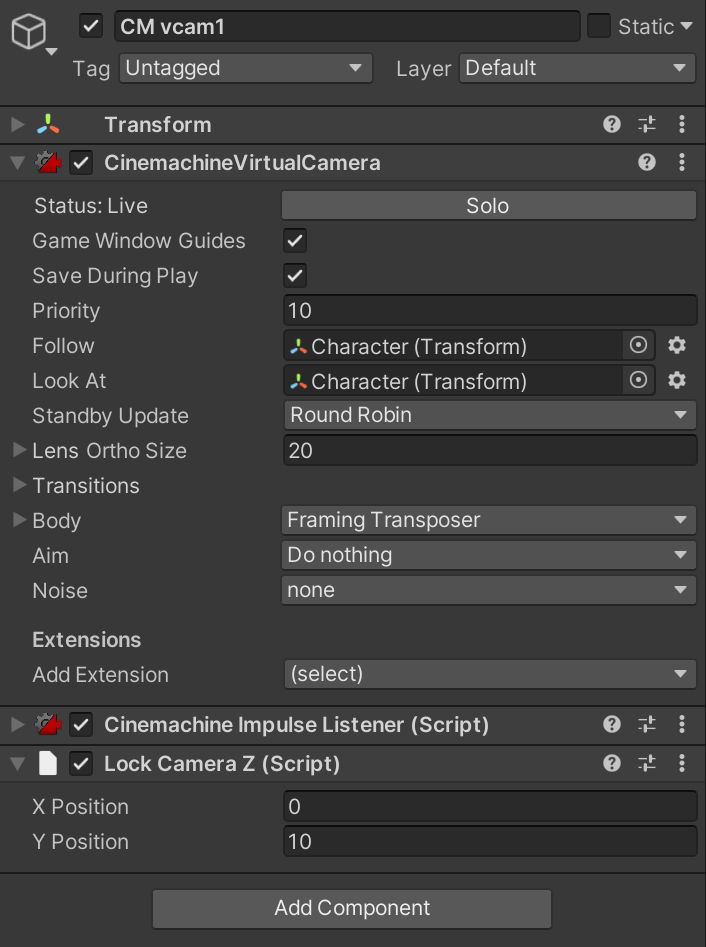

# Lock Camera Z

[Scripting API](/api/softtissue.Core.Camera.LockCameraZ.html)

## 使用

用於 Cinemachine Extensions 鎖定 X 軸與 Y 軸。

- CinimachineVirtualCamera
  - Extensions
    - Add Extensions > LockCameraZ

## 結構

```
Camera/
├─ Main Camera
├─ CM vcam 1
```

## 圖例


